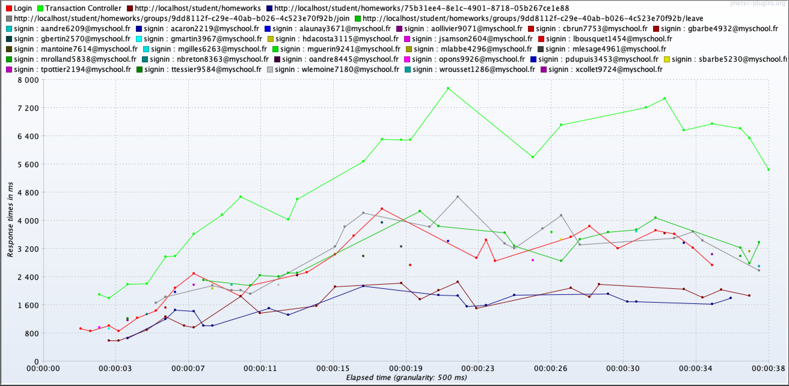

```
# RAPPORT DE PERFORMANCES 1 (S) : MySchool

Adel Senhadji [adxl](https://github.com/adxl)  
Ayoub Madani-Fouatih [MizuchiOryu](https://github.com/MizuchiOryu)  
Maxime Marchand [ThePiotrow](https://github.com/ThePiotrow)  
Jérémy Jumpertz [jumpertz](https://github.com/jumpert)

4IW2
28/06/2022

---

## Description de l'application

L'application est un extranet d'établissement scolaire permettant la gestion
administrative d'une école

L'objectif est de faciliter la gestion d'un établissement sous 3 angles :

- Administrateur : il peut gérer l'établissement (comptes, salles, cours, filières)
- Professeur : il peut gérer sa classe, affecter des notes, des projets, la présence
- Étudiants : d'accéder à leurs document de cours, planning, notes, projets pédagogique

L'objectif est de réaliser un stress test pour connaître les points de rupture de l'application.

## L'architecture

L'architecture est basé sur du multi-container (Docker), avec un serveur Apache2
et une base de données PostgreSQL.
On utilise Symfony 5.4.9 (PHP 8.0) en back, avec un moteur de templetage Twig et
webpack pour compiler le JavaScript et Sass.

L'application est hébergée sur Heroku.

## Exigences du test

L'objectif du test de stress est de :

- Identifier les problèmes susceptibles de se produire avec un fort trafic.


| Business Transactions          | User Load | Response Time | Transactions per user |
| ------------------------------ | :-------: | :-----------: | :-------------------: |
| Access Login page              |    200     |       1       |         ~450          |
| Access Student page            |    200     |       1       |         ~450          |
| Access Homeworks page          |    200     |       1       |         ~450          |
| Access Specific homeworks page |    200     |       1       |         ~450          |
| Join a group                   |    200     |       1       |         ~450          |


## Environnement de tests

Environnement de test :
- CPU : MacBook Pro (13-inch, Intel Core i5 quadra core, 2020)
- Mémoire : 8GB
- OS: macOS Monterey 12.4

Environnement de production :
- CPU : Linux enterprise 2 cores
- Mémoire : 512 Mb
- OS: Linux Alpine

## Planification des tests

- Métriques surveillées : 
    - CPU - RAM 
    - Réseau (response time)

## Étapes de tests

Etape student:

| Step # | Business Process Name : Product Ordering |
| ------ | :--------------------------------------: |
| 1      |                  Login                   |
| 2      |                   Home                   |
| 3      |                 Student                  |
| 4      |                Homeworks                 |
| 5      |            Specific homeworks            |
| 6      |               Join a group               |

Jeu de donnée :
 - Type de donnée : donnée en base NoSQL
 - Quantité de donnée :10 MB
 - Provenance : Fixtures(donnée de mock)

## Execution des tests

En prérequis la base va être alimenté avec 10 MB de données.

| #   | Cycle |  Test Run   |  Time  |
| --- | :---: | :---------: | :----: |
| 1   |   2   | Stress Test | 30 min |

|             |                                      Test Details                                      |
| ----------- | :------------------------------------------------------------------------------------: |
| **Purpose** | Le test a pour but de determiné les capacité maximal que l'application peut supporter. |
Ce test est conçu pour collecter des mesures de performances et l'utilisation des ressources système.

| **No. of Cycle** | 1
| **No. of Tests** | 1 (1 tests per cycle) |
| **Duration** | Ramp-up: 50 - Steady State: 10
| **Scripts** | 1. XXXX - 2. XXXX |
| **Scenario Name** | Stress Test Scenario |
| **User Load / Volume** | 200 Vusers (Threads) Load |
| **Entry Criteria** |1. Le code doit etre stable et fonctionnel 2. L'environnement de test doit etre configuré et prêt a l'emploi.3. Le jeu de données de test doit etre disponible .4. Les scripts de test doivent etre stable et fonctionel.


## Résultats des tests
Ici, référencez les graphiques et données résultant des tests effectués



## Analyses et Optimisations proposées
Après avoir effectué une comparaison entre les résultats obtenus et ceux escomptés, analyser les résultats et tentez de proposer des axes d'amélioration. Ceux-ci peuvent être :
- Optimisation d'un service grâce a de meilleurs algorithmes
- Optimisation de l'infrastructure (scalabilité accrue par exemple)
- Détection d'éventuels goulots d'étranglements
 

```
